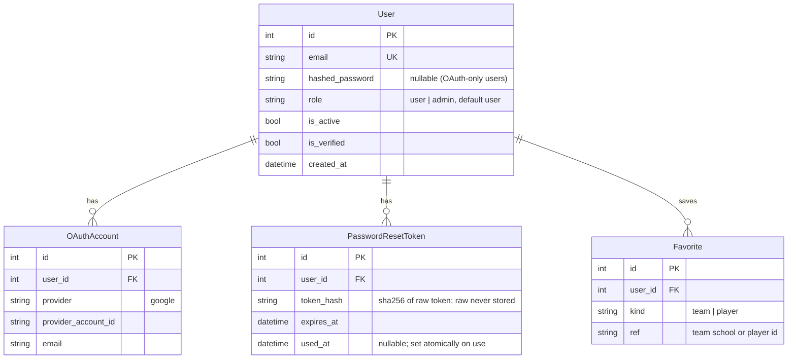
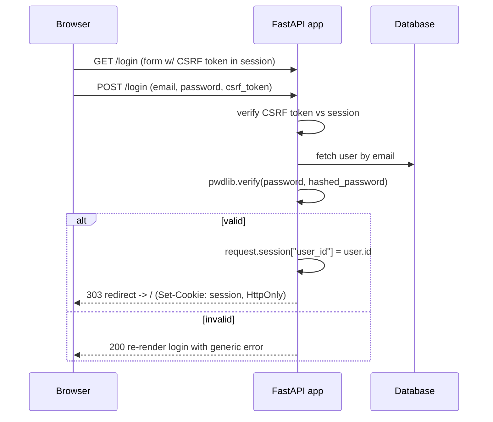

# feat: Add user authentication

**Product Contract preservation:** No upstream brainstorm existed; scope was established directly with the user (see Scope Decisions). This is a `ce-plan-bootstrap` artifact.

---

## Summary

Gridiron is currently a **public, read-only** college-football stats site: every route is a `GET`, there is no user table, no sessions, no write paths, and no email infrastructure. This plan adds the site's first authentication layer:

- Email/password **registration**, **login**, **logout**
- **Password reset** via emailed link
- **Google SSO** (OAuth 2.0 / OpenID Connect)
- **Server-side session cookies** (HttpOnly signed cookie via Starlette `SessionMiddleware`)
- A **user / admin role** system with an admin-gated area
- **Personalization**: authenticated users can save favorite teams and players

The approach is **hand-rolled on top of well-maintained primitives** — `pwdlib` (Argon2) for hashing, `Authlib` for Google OIDC, Starlette `SessionMiddleware` for sessions, and server-rendered Jinja forms — rather than the JSON-first, maintenance-mode `fastapi-users` library. This fits the existing server-rendered architecture and keeps the auth flows native to the current Jinja pages.

All work is DB-agnostic (SQLite dev / Postgres prod) and follows the repo's existing Alembic + SQLAlchemy 2.0 conventions.

---

## Scope Decisions (established with user)

| Fork | Decision |
| --- | --- |
| What accounts unlock | **Personalization + admin/curation roles** — build the full mechanism *and* a user/admin role split *and* saved-favorites personalization. |
| SSO providers | **Google only** (pattern extensible to others later). |
| Session mechanism | **Server-side session cookies** (HttpOnly signed cookie), not JWT bearer tokens. |

---

## Problem Frame

The site has no concept of a user. To support personalization (saved favorites) and future curation, it needs identity, credentials, sessions, and authorization — introduced without disturbing the existing read-only browsing experience (anonymous users keep full read access to all current pages).

Constraints carried from the codebase:
- **Server-rendered**: pages are Jinja templates rendered by FastAPI; auth flows must be HTML forms, not a JSON/SPA API.
- **DB-portable**: models use portable column types and run on SQLite and Postgres; Alembic migrations use `render_as_batch=True`.
- **Zero-setup default**: the app must still boot and run read-only with no auth configured (missing Google/SMTP creds degrade gracefully, they do not crash the app).
- **`uv` tooling**, Python ≥3.10, pydantic-settings config from `.env`.

---

## Requirements

| ID | Requirement |
| --- | --- |
| R1 | A visitor can register with email + password; passwords are stored only as Argon2 hashes. |
| R2 | A registered user can log in and receives a session cookie; wrong credentials are rejected with a generic error. |
| R3 | A logged-in user can log out, clearing the session. |
| R4 | A user can request a password reset by email and set a new password via a single-use, time-limited link. |
| R5 | A visitor can sign in / register with Google; a Google identity links to (or creates) a Gridiron account. |
| R6 | Sessions are carried in an HttpOnly, signed, `SameSite=Lax` cookie; `Secure` in production. |
| R7 | Accounts carry a role (`user` default / `admin`); an admin-only area is reachable only by admins. |
| R8 | A logged-in user can add/remove favorite teams and players and view a "My Favorites" page. |
| R9 (NFR) | All state-changing form POSTs are CSRF-protected; register/reset responses do not leak account existence. |
| R10 (NFR) | Anonymous users retain full read access to all existing pages; the app boots with no auth config present. |
| R11 (NFR) | Every new flow has automated tests (`TestClient`), runnable offline on SQLite. |

---

## High-Level Technical Design

### New module & data shape

The auth code lives in a new `gridiron/auth/` package; ORM models join the existing single `gridiron/db/models.py` (repo convention — all models live there).



### Session-aware request flow (email/password login)



### Google OAuth (Authlib, OIDC discovery)

```mermaid
sequenceDiagram
    participant B as Browser
    participant A as FastAPI app
    participant G as Google
    B->>A: GET /auth/google/login
    A->>A: store state/nonce in session
    A-->>B: 302 -> Google authorize URL
    B->>G: authenticate & consent
    G-->>B: 302 -> /auth/google/callback?code&state
    B->>A: GET callback
    A->>G: exchange code -> token + userinfo (Authlib)
    A->>A: verify state; read email + sub
    A->>A: find-or-create User + OAuthAccount, set session
    A-->>B: 303 redirect -> /
```

---

## Output Structure

New files (existing files modified are listed per-unit):

```
gridiron/
  auth/
    __init__.py
    security.py        # pwdlib hashing, current-user & role deps, CSRF helpers, session context
    email.py           # email sender abstraction: SMTP transport + dev console transport
    oauth.py           # Authlib OAuth registry (Google), find-or-link user
    routes.py          # auth router: register / login / logout / reset request+confirm
    favorites.py       # favorites router: add / remove / list (protected)
    cli.py             # gridiron-admin: promote/demote a user's role
  web/templates/
    auth/
      register.html
      login.html
      reset_request.html
      reset_confirm.html
    favorites.html
    admin/
      users.html       # minimal admin-gated user list
migrations/versions/
  <rev>_add_auth_tables.py         # User, OAuthAccount, PasswordResetToken
  <rev>_add_favorites.py           # Favorite
tests/
  test_auth_security.py
  test_auth_register_login.py
  test_auth_reset.py
  test_auth_oauth.py
  test_auth_roles.py
  test_favorites.py
```

The tree is a scope declaration, not a constraint — the implementer may adjust layout if a cleaner one emerges. Per-unit `Files:` lists remain authoritative.

---

## Key Technical Decisions

**KTD1 — Hand-rolled auth over `fastapi-users`.** `fastapi-users` covers registration/login/reset/OAuth in one package but is **JSON/API-first** (its routers return JSON and assume a separate frontend) and entered **maintenance mode** in 2025. This site is server-rendered; adapting JSON routers to HTML form flows fights the grain. We hand-roll thin Jinja form handlers over maintained primitives, optionally borrowing `httpx-oauth` indirectly via Authlib. *(Research: fastapi-users PyPI 15.0.x / maintenance-mode notice, Mar 2026.)*

**KTD2 — `pwdlib` (Argon2id) for password hashing, not `passlib`.** `passlib` is unmaintained (last release 2020) and depends on the `crypt` module removed in Python 3.13 (PEP 594). `pwdlib` is the FastAPI ecosystem's chosen successor (FastAPI's own tutorial migrated to it in 2025). Use `PasswordHash.recommended()` (Argon2id). *(Research: FastAPI PR #13917; pwdlib docs.)*

**KTD3 — Starlette `SessionMiddleware` signed cookie for sessions.** Adequate to hold `user_id` for a login session; simplest fit. Cookie flags: `HttpOnly` (always), `https_only=True` in prod (Secure), `same_site="lax"`. The signed cookie is tamper-proof but **not encrypted** — store only `user_id`, never secrets. A server-side session store (Redis/`starsessions`) is **deferred** until revocation / force-logout-all is needed. *(Research: Starlette middleware docs.)*

**KTD4 — Explicit CSRF tokens for form POSTs.** Starlette ships no CSRF protection and `SameSite=Lax` is defense-in-depth, not a substitute. Use the **session-bound hidden-token** pattern: generate a per-session token, embed it as a hidden field in every auth/favorites form, validate on POST with constant-time comparison. *(Research: OWASP; starlette-wtf pattern.)*

**KTD5 — Google via Authlib OIDC discovery.** Register the client with `server_metadata_url=".../.well-known/openid-configuration"` and `scope="openid email profile"`; Authlib stores state/nonce in the session and exposes `token["userinfo"]`. Note Google's 2025 change: **client secrets are hashed and shown once at creation** — store in a secret manager immediately. *(Research: Authlib FastAPI docs; Google OAuth policy updates Oct–Dec 2025.)*

**KTD6 — Password reset = random token, store only its hash, single-use & atomic.** Generate `secrets.token_urlsafe(32)`, email the raw token in the link, persist only its SHA-256 hash with `expires_at` (30 min). On confirm, **consume the token in the same UPDATE** that sets the new password (token hash as a WHERE condition) to prevent replay/races; invalidate the user's other sessions. Register/reset endpoints return **generic** responses (no account-enumeration). *(Research: OWASP Forgot-Password cheat sheet; CVE-2026-32943 on non-atomic single-use.)*

**KTD7 — Email via stdlib `smtplib`, with a dev console transport.** No new email dependency. An `EmailSender` abstraction has an SMTP transport (configured via settings) and a console transport that logs the reset link to stdout when SMTP is unconfigured — keeps the zero-setup default (R10).

**KTD8 — Roles as a `role` string column + admin bootstrap CLI.** `role` defaults to `"user"`; `"admin"` unlocks the admin area. First admin is promoted via a new `gridiron-admin` CLI (`gridiron-admin promote <email>`), with optional `ADMIN_EMAILS` env auto-promotion on login as a convenience.

---

## Implementation Units

Grouped into three phases. Units are dependency-ordered; U-IDs are stable.

### Phase A — Foundations

### U1. Auth configuration & dependencies

**Goal:** Add the dependencies and settings needed by every later unit.
**Requirements:** R6, R10 (config-optional boot).
**Dependencies:** none.
**Files:**
- `pyproject.toml` (add deps)
- `gridiron/config.py` (extend `Settings`)
- `.env.example` (document new vars)
- `tests/test_auth_security.py` (settings-default assertions)

**Approach:**
- Add runtime deps: `authlib>=1.7`, `pwdlib[argon2]>=0.2`, `python-multipart>=0.0.9` (FastAPI form parsing), `email-validator>=2.0` (pydantic `EmailStr`), `itsdangerous>=2.0` (explicit; `SessionMiddleware` dep).
- Extend `Settings` with: `secret_key: str | None` (session signing), `session_cookie_secure: bool = False`, `base_url: str = "http://127.0.0.1:8000"`, `google_client_id/google_client_secret: str | None`, `smtp_host/port/user/password/from_addr: str | None`, `password_reset_ttl_minutes: int = 30`, `admin_emails: str = ""`.
- Provide a derived helper for the effective signing key: if `secret_key` unset, generate an ephemeral per-process key **and log a warning** that sessions won't survive restarts (dev only) — never crash.
- Update `.env.example` with commented entries for all new vars.

**Patterns to follow:** existing `Settings` in `gridiron/config.py` (pydantic-settings, `@lru_cache get_settings`).
**Test scenarios:**
- Defaults: with no env set, `get_settings()` yields `role`-agnostic defaults and `secret_key is None` without error.
- `ADMIN_EMAILS="a@x.com,b@y.com"` parses to a normalized set (case-insensitive, trimmed).
- `Test expectation:` config unit is thin; behavioral coverage lives in later units.

---

### U2. Auth data model + migration

**Goal:** Add `User`, `OAuthAccount`, `PasswordResetToken` tables.
**Requirements:** R1, R4, R5, R7.
**Dependencies:** U1.
**Files:**
- `gridiron/db/models.py` (add three models)
- `migrations/versions/<rev>_add_auth_tables.py`
- `tests/test_auth_security.py` (model/migration round-trip)

**Approach:**
- `User`: `id` (autoincrement PK), `email` (String(320), unique, indexed, stored lowercased), `hashed_password` (String, nullable — OAuth-only users), `role` (String(16), default `"user"`), `is_active` (bool, default True), `is_verified` (bool, default False — reserved for future email verification), `created_at` (DateTime). Add a Python-level `is_admin` property (`role == "admin"`).
- `OAuthAccount`: `id`, `user_id` FK→users, `provider` (String), `provider_account_id` (String), `email` (String). `UniqueConstraint(provider, provider_account_id)`.
- `PasswordResetToken`: `id`, `user_id` FK, `token_hash` (String(64), indexed), `expires_at` (DateTime), `used_at` (DateTime, nullable).
- Portable column types only; relationships mirror existing style. Generate the Alembic migration with `render_as_batch` (already configured in `migrations/env.py`); verify it runs clean on SQLite and Postgres.

**Patterns to follow:** existing models in `gridiron/db/models.py` (`mapped_column`, `UniqueConstraint`, indexes); existing migrations under `migrations/versions/`.
**Test scenarios:**
- Migration `upgrade` then `downgrade` runs without error on SQLite.
- Inserting two users with the same email (differing case) violates the unique constraint.
- `User(role="admin").is_admin is True`; default `is_admin is False`.
- `OAuthAccount` duplicate `(provider, provider_account_id)` is rejected.
- `Test expectation:` covers schema invariants; flow behavior lives in U4–U6.

---

### U3. Security core: hashing, sessions, current-user & role dependencies, CSRF

**Goal:** The security primitives every flow depends on.
**Requirements:** R2, R6, R7, R9.
**Dependencies:** U1, U2.
**Files:**
- `gridiron/auth/__init__.py`
- `gridiron/auth/security.py`
- `gridiron/api/main.py` (add `SessionMiddleware`; register a Jinja context processor injecting `user`)
- `tests/test_auth_security.py`

**Approach:**
- `hash_password` / `verify_password` via `pwdlib.PasswordHash.recommended()` (Argon2id); expose `needs_rehash` for future upgrades.
- Session helpers: `login_session(request, user)` sets `request.session["user_id"]`; `logout_session(request)` clears it.
- Dependencies: `current_user(request, db) -> User | None` (reads `user_id` from session, loads active user); `require_user` (raises 401→redirect to `/login`); `require_admin` (403 for non-admins).
- CSRF: `issue_csrf(request)` stores/returns a per-session token; `verify_csrf(request, submitted)` constant-time compares and rejects mismatch. A small dependency wraps POST form validation.
- Wire `SessionMiddleware` into `app` in `gridiron/api/main.py` using the effective signing key and cookie flags from settings (HttpOnly implicit, `https_only=settings.session_cookie_secure`, `same_site="lax"`).
- Register a Jinja `context_processors` entry (or set `request.state.user` in a lightweight middleware) so all templates can read `user` without per-route plumbing.

**Patterns to follow:** existing `get_db` dependency in `gridiron/db/session.py`; existing `Jinja2Templates` setup in `gridiron/api/main.py`.
**Execution note:** implement `verify_password` / CSRF verify test-first — these are the security-critical seams.
**Test scenarios:**
- `verify_password(pw, hash_password(pw))` is True; wrong password is False; hash is not the plaintext and starts with an Argon2 identifier.
- `current_user` returns None when no session; returns the user when `user_id` is set; returns None when the user is inactive.
- `require_admin` allows an admin user and rejects a `user`-role user with 403.
- `verify_csrf` accepts the issued token and rejects a tampered/absent token (constant-time path exercised).
- A request with a valid session cookie round-trips through `TestClient` (cookie is HttpOnly).

---

### Phase B — Core auth flows

### U4. Registration, login, logout (server-rendered forms)

**Goal:** The three core email/password flows end to end, wired into the nav.
**Requirements:** R1, R2, R3, R9, R10.
**Dependencies:** U3.
**Files:**
- `gridiron/auth/routes.py` (register/login/logout GET+POST)
- `gridiron/web/templates/auth/register.html`, `login.html`
- `gridiron/web/templates/base.html` (session-aware nav: Login/Register vs. username/Logout)
- `gridiron/api/main.py` (`include_router`)
- `tests/test_auth_register_login.py`

**Approach:**
- `GET /register` / `GET /login` render forms with an embedded CSRF token; `POST` validates CSRF, validates input (`EmailStr`, min password length), and on success creates the user (hashed password) / sets the session, then `303` redirect to `/`.
- Duplicate-email registration returns a **generic** "could not create account" (or re-render with a non-enumerating message) per R9.
- Login failure re-renders with a single generic "invalid email or password".
- `POST /logout` clears the session and redirects home; nav shows Login/Register when anonymous, the email + Logout when authenticated.
- Auto-promote to admin on login if the email is in `ADMIN_EMAILS` (KTD8 convenience).

**Patterns to follow:** existing page handlers + `TemplateResponse` in `gridiron/api/main.py`; template structure in `gridiron/web/templates/*.html` (extends `base.html`).
**Execution note:** start with a failing integration test for register→login→access→logout.
**Test scenarios:**
- Register with valid email/password → 303 to `/`, session cookie set, `User` row exists with a non-plaintext hash.
- Register with an already-used email → no second row created, generic non-enumerating response.
- Register with invalid email / too-short password → form re-renders with validation errors, no row created.
- Login with correct credentials → session established; a subsequent request sees `current_user`.
- Login with wrong password / unknown email → generic error, no session; identical response body for both (no enumeration).
- POST without/invalid CSRF token → rejected (403), no state change.
- Logout → session cleared; nav reverts to Login/Register.
- Anonymous access to existing read pages (`/`, `/teams`) still returns 200 (R10).

---

### U5. Password reset via email

**Goal:** Emailed, single-use, time-limited password reset.
**Requirements:** R4, R9.
**Dependencies:** U3, U4.
**Files:**
- `gridiron/auth/email.py` (`EmailSender`: SMTP + console transports)
- `gridiron/auth/routes.py` (reset request + confirm GET+POST)
- `gridiron/web/templates/auth/reset_request.html`, `reset_confirm.html`
- `tests/test_auth_reset.py`

**Approach:**
- `POST /reset` (request): look up user by email; if found, create a `PasswordResetToken` (store `sha256(raw)`, `expires_at = now + ttl`), and email a link `"{base_url}/reset/confirm?token={raw}"`. **Always** return the same generic "if that email exists, a link was sent" (R9).
- `EmailSender` picks SMTP when configured, else logs the link to stdout (dev). Failures are logged, not fatal.
- `GET /reset/confirm?token=…` validates the token (exists, unexpired, unused) and renders the new-password form (with CSRF); `POST` re-validates and **atomically** consumes the token (single UPDATE guarded on `token_hash` + `used_at IS NULL`) while setting the new hashed password; invalidate the user's other sessions (bump a session marker / clear). Expired/used/unknown tokens render a generic "link invalid or expired".

**Patterns to follow:** `session_scope` transactional pattern in `gridiron/db/session.py` for the atomic consume.
**Execution note:** test-first on the atomic single-use consume (the replay guard).
**Test scenarios:**
- Reset request for an existing email → token row created, email/console transport invoked with a link containing the raw token; response is the generic message.
- Reset request for an unknown email → identical generic message, **no** token row (no enumeration).
- Confirm with a valid token → password updated (new hash verifies, old one no longer), token marked `used_at`.
- Confirm with the **same** token a second time → rejected (single-use), password unchanged.
- Confirm with an expired token → rejected with generic invalid message.
- Confirm with a tampered/unknown token → rejected.
- Confirm POST without valid CSRF → rejected.
- After a successful reset, a pre-existing session for that user is invalidated.

---

### U6. Google SSO (OAuth)

**Goal:** Sign in / register with Google, linking to a Gridiron account.
**Requirements:** R5, R10 (graceful when unconfigured).
**Dependencies:** U3, U4.
**Files:**
- `gridiron/auth/oauth.py` (Authlib registry + find-or-link)
- `gridiron/auth/routes.py` (login + callback routes)
- `gridiron/web/templates/auth/login.html`, `register.html` ("Continue with Google" button — shown only when configured)
- `tests/test_auth_oauth.py`

**Approach:**
- Configure Authlib `OAuth` with Google via `server_metadata_url` (OIDC discovery) and `scope="openid email profile"`; register only if `google_client_id/secret` are set (button hidden otherwise → R10).
- `GET /auth/google/login` → `authorize_redirect` (state/nonce in session).
- `GET /auth/google/callback` → `authorize_access_token`, read `token["userinfo"]` (`sub`, `email`). Find `OAuthAccount(provider="google", provider_account_id=sub)`; if absent, link to an existing `User` by verified email or create a new `User` (no password) + `OAuthAccount`. Set the session, redirect home.
- Guard callback against missing/invalid state (Authlib enforces) and mismatched/absent email.

**Patterns to follow:** existing route + settings-gating patterns; `httpx` is already a dependency (Authlib's client).
**Test scenarios:** *(mock the Google token exchange — do not hit Google.)*
- Callback for a **new** Google identity → creates `User` + `OAuthAccount`, sets session, redirects home.
- Callback for a returning Google identity → reuses the existing `User`, no duplicate rows.
- Callback whose Google email matches an existing password user → links a new `OAuthAccount` to that user (no duplicate account).
- `/auth/google/login` when Google is **unconfigured** → 404/redirect with a clear message; the Google button is absent from the login page.
- Callback with invalid/missing state → rejected, no session.

---

### Phase C — Authorization & personalization

### U7. Roles & admin area + bootstrap CLI

**Goal:** Enforce the admin role and provide a way to grant it.
**Requirements:** R7.
**Dependencies:** U3, U4.
**Files:**
- `gridiron/auth/cli.py` (`gridiron-admin`)
- `pyproject.toml` (`[project.scripts]` entry)
- `gridiron/auth/routes.py` (admin-gated `/admin/users`)
- `gridiron/web/templates/admin/users.html`
- `gridiron/web/templates/base.html` (Admin nav link shown only to admins)
- `tests/test_auth_roles.py`

**Approach:**
- `gridiron-admin promote <email>` / `demote <email>` sets `User.role`; prints a clear result; errors if the user doesn't exist.
- `GET /admin/users` depends on `require_admin`, listing users (email, role, created_at) read-only — a minimal, extensible admin surface.
- Nav shows the Admin link only when `user.is_admin`.

**Patterns to follow:** existing CLI entry points in `pyproject.toml` (`gridiron-ingest` → `gridiron.ingest.cli:main`) and their `main()` shape.
**Test scenarios:**
- `require_admin`: admin → 200 on `/admin/users`; `user` role → 403; anonymous → redirect to `/login`.
- CLI `promote` sets role to admin; `demote` sets it back; unknown email exits non-zero with a message.
- Admin nav link present for admins, absent for regular/anonymous users.

---

### U8. Saved favorites (personalization)

**Goal:** Logged-in users save/remove favorite teams and players and view them.
**Requirements:** R8, R9.
**Dependencies:** U2, U3, U4.
**Files:**
- `gridiron/db/models.py` (`Favorite` model)
- `migrations/versions/<rev>_add_favorites.py`
- `gridiron/auth/favorites.py` (add/remove/list routes, `require_user`)
- `gridiron/web/templates/favorites.html`
- `gridiron/web/templates/team.html`, `player.html` (favorite/unfavorite button when logged in)
- `gridiron/web/templates/base.html` (Favorites nav link when logged in)
- `tests/test_favorites.py`

**Approach:**
- `Favorite(id, user_id FK, kind ["team"|"player"], ref)` with `UniqueConstraint(user_id, kind, ref)`; migration as U2.
- `POST /favorites/add` / `POST /favorites/remove` (CSRF-protected, `require_user`) toggle a favorite and redirect back.
- `GET /favorites` renders the user's saved teams/players with links to their pages.
- On `team.html` / `player.html`, show a favorite/unfavorite button only to authenticated users (anonymous users see the page unchanged → R10).

**Patterns to follow:** existing `team.html` / `player.html` context assembly in `gridiron/api/main.py`; model + migration conventions from U2.
**Test scenarios:**
- Authenticated add-favorite → `Favorite` row created; `/favorites` lists it.
- Adding the same favorite twice → idempotent (no duplicate row).
- Remove-favorite → row deleted; `/favorites` no longer lists it.
- Anonymous POST to `/favorites/add` → redirect to `/login`, no row created.
- Favorites add/remove without valid CSRF → rejected.
- Favorite button hidden for anonymous visitors on `team.html`.

---

## Verification Contract

- **Automated:** `uv run pytest` — all new test files (`test_auth_security`, `test_auth_register_login`, `test_auth_reset`, `test_auth_oauth`, `test_auth_roles`, `test_favorites`) pass alongside the existing suite, offline on SQLite.
- **Lint:** `uv run ruff check` clean.
- **Migrations:** `uv run alembic upgrade head` then `downgrade` runs clean on SQLite; spot-check `upgrade head` against the docker-compose Postgres.
- **Manual smoke (dev):** register → login → save a favorite → logout → request reset (link printed to console) → confirm reset → login with new password. With Google creds set, complete a Google sign-in.
- **Regression:** anonymous browsing of all existing pages still returns 200.

## Definition of Done

R1–R11 satisfied; each feature-bearing unit's test scenarios implemented and green; `ruff` clean; migrations up/down clean on SQLite and applied on Postgres; `.env.example` documents every new setting; the app still boots and serves read-only with no auth config present.

---

## System-Wide Impact

- **`gridiron/api/main.py`** gains `SessionMiddleware`, three included routers, and a template context processor — the first middleware and first write endpoints in the app.
- **`base.html`** nav becomes session-aware (affects every page).
- **Deployment (`docker-entrypoint.sh` / compose):** `alembic upgrade head` already runs, so the new tables migrate automatically. Two operational notes: (1) `SECRET_KEY` **must** be set in prod or sessions reset on every restart; (2) the read-only demo container uses an ephemeral/volume SQLite file — registrations persist only as long as that volume does. Surface both in deployment docs.
- **Reverse proxy / HTTPS:** set `session_cookie_secure=true` in prod; ensure the app trusts `X-Forwarded-Proto` so `Secure`/redirect URIs are correct.

## Risks & Mitigations

| Risk | Mitigation |
| --- | --- |
| **Brute-force / credential stuffing** on login & reset | No rate-limit infra today — **deferred**, called out below. Argon2 slows offline cracking; note per-IP throttling as the first follow-up. |
| **Account enumeration** via register/reset timing or messaging | Generic responses (R9); identical bodies for valid/invalid. Timing-side-channel mitigation is best-effort. |
| **CSRF** on new POST endpoints | Session-bound hidden-token check on every form (KTD4). |
| **Session cookie not encrypted** | Store only `user_id`; `HttpOnly`+`Secure`+`SameSite=Lax` (KTD3). |
| **Google secret handling** (hashed/shown-once since 2025) | Store client secret in a secret manager at creation; document rotation. |
| **`SECRET_KEY` unset in prod** | App logs a loud warning and uses an ephemeral key (dev-only); DoD requires it set in prod. |
| **Reset-token replay/race** | Atomic single-use consume (KTD6). |

---

## Scope Boundaries

**In scope:** R1–R11 above — email/password auth, password reset, Google SSO, session cookies, user/admin roles + minimal admin area, saved-favorites personalization, CSRF, and tests.

### Deferred to Follow-Up Work
- **Rate limiting / brute-force protection** (per-IP + per-account throttles) — highest-priority follow-up.
- **Mandatory email verification** on signup (the `is_verified` column is reserved for it).
- **Account self-service**: change email/password while logged in, delete account.
- **Additional SSO providers** (GitHub, Apple) — same Authlib pattern.
- **Server-side session store** (Redis) for revocation / force-logout-all and "remember me".
- **Richer admin UI** beyond the read-only user list.

### Outside this product's identity
- Anonymous read access to all current stats pages is **permanent** — auth augments, it does not gate the existing browsing experience.

---

## Sources & Research

External research was **load-bearing** — it shaped KTD1, KTD2, KTD3, KTD5, and KTD6.

- FastAPI password-hash migration to pwdlib/Argon2 — https://fastapi.tiangolo.com/tutorial/security/oauth2-jwt/ , https://github.com/fastapi/fastapi/pull/13917
- pwdlib — https://github.com/frankie567/pwdlib , https://www.fvoron.com/blog/introducing-pwdlib-a-modern-password-hash-helper-for-python/
- fastapi-users (maintenance-mode; JSON-first) — https://fastapi-users.github.io/fastapi-users/latest/ , https://pypi.org/project/fastapi-users/
- Authlib + FastAPI/Starlette Google login — https://docs.authlib.org/en/latest/oauth2/client/web/fastapi.html , https://blog.authlib.org/2020/fastapi-google-login
- Google OAuth policy updates (client secret hashing, OOB removal) — https://developers.google.com/identity/protocols/oauth2/policies , https://support.google.com/cloud/answer/15549257
- Starlette sessions/middleware & CSRF patterns — https://www.starlette.io/middleware/ , https://github.com/amorey/starlette-wtf
- OWASP Forgot Password Cheat Sheet — https://cheatsheetseries.owasp.org/cheatsheets/Forgot_Password_Cheat_Sheet.html
- Non-atomic single-use reset token race — https://nvd.nist.gov/vuln/detail/CVE-2026-32943

## Local Patterns Referenced

- `gridiron/config.py` — pydantic-settings `Settings` + `@lru_cache get_settings` (extended in U1).
- `gridiron/db/models.py` — single-file ORM, portable columns, `UniqueConstraint`/indexes (U2, U8).
- `migrations/env.py` — `render_as_batch=True`, models/URL wired from the app (U2, U8).
- `gridiron/db/session.py` — `get_db` dependency + `session_scope` (U3, U5).
- `gridiron/api/main.py` — `Jinja2Templates`, `TemplateResponse`, route/handler style (U3–U8).
- `tests/conftest.py` + `tests/test_api.py` — isolated-SQLite `db_env` fixture, `TestClient` (all test files; conftest gains a `SECRET_KEY` env for the auth fixture).
- `pyproject.toml` `[project.scripts]` — CLI entry-point convention (U7).
